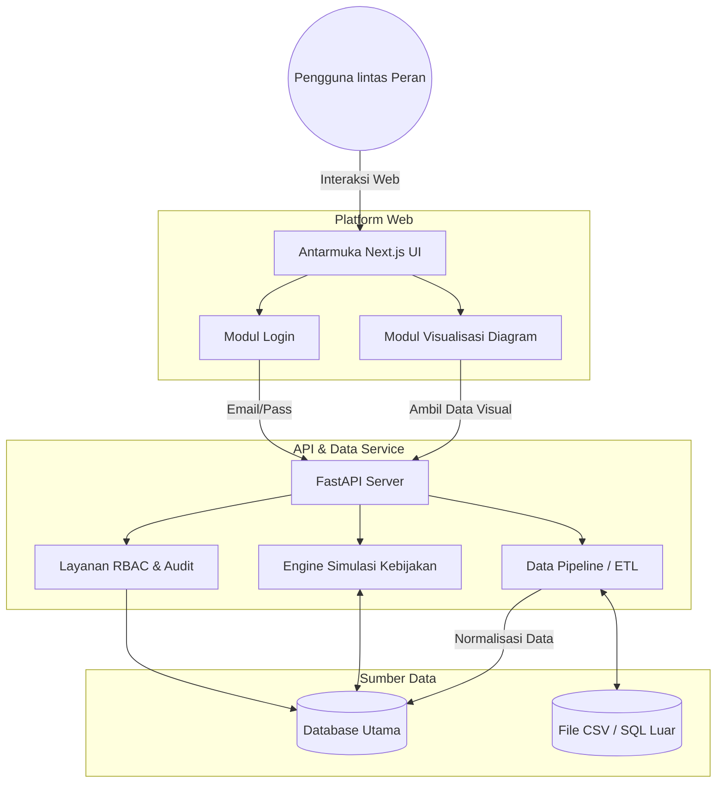
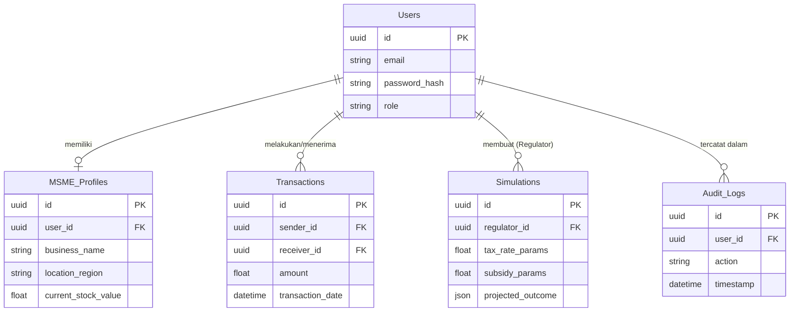

# PRD — Project Requirements Document

## 1. Overview
**TownSync ERP** adalah platform web berbasis *economic intelligence* (intelijen ekonomi) yang dikembangkan untuk PT. Urban Ecosystem Solutions. Masalah utama yang ingin diselesaikan oleh aplikasi ini adalah sulitnya memetakan distribusi kekayaan secara akurat, mendeteksi munculnya pasar baru (*emergent market*), serta mengukur potensi dampak dari suatu kebijakan ekonomi di sebuah wilayah. 

Tujuan utama dari TownSync ERP adalah menyediakan visualisasi ekologi distribusi kekayaan, mengolah data ekonomi dari berbagai sumber, dan secara khusus memberdayakan pihak pembuat kebijakan (Regulator) melalui simulasi kebijakan ekonomi yang berbasis data.

## 2. Requirements
Berikut adalah persyaratan utama yang harus dipenuhi oleh platform ini:
- **Fokus Prioritas (MVP):** Sistem harus difokuskan pada fitur **Simulasi Kebijakan** terlebih dahulu agar Regulator dapat memodelkan kebijakan subsidi atau pajak sebelum dirilis.
- **Multiperangkat:** Antarmuka harus responsif dan nyaman digunakan baik di layar Desktop maupun Mobile, untuk mengakomodasi berbagai lingkungan kerja pengguna (seimbang).
- **Sistem Keamanan:** Penggunaan metode otentikasi standar (Email/Password), dilengkapi dengan enkripsi data (baik saat dikirim maupun disimpan) dan pencatatan riwayat aktivitas (*Audit Log*).
- **Kustomisasi Visual:** UI/UX harus memiliki tema warna (visual) yang berbeda secara otomatis menyesuaikan dengan peran/hak akses pengguna untuk meminimalisir kesalahan operasional.

## 3. Core Features
Fitur-fitur utama dirancang berdasarkan kebutuhan dan peran akses (*Role-Based Access Control* / RBAC):

- **Simulasi Kebijakan Ekonomi (MVP - Khusus Regulator):** Mesin simulasi di mana (*Regulator*) dapat memasukkan parameter besaran subsidi atau tarif pajak, untuk memproyeksikan dampaknya terhadap distribusi kekayaan antar UMKM dan masyarakat.
- **Dashboard Visualisasi Data (Peran Analis & Regulator):** Menampilkan pemetaan aliran transaksi ekonomi (uang/barang) antar entitas bisnis menggunakan grafik interaktif (*flow map* atau *network diagram*). Lengkap dengan peta analisis panas (*heatmap*) wilayah.
- **Data Pipeline & ETL Otomatis (Sistem & Admin):** Mesin pengumpul dan penyelarasan data secara otomatis dari berbagai sumber (file CSV, database SQL) untuk diubah menjadi format data yang siap dianalisis tanpa input manual terus menerus.
- **Sistem Deteksi Anomali & Pasar Baru (Sistem):** Pendeteksi otomatis berbasis tren riwayat data yang akan memberikan notifikasi jika ada tren pertumbuhan pasar baru atau adanya ketimpangan (monopoli) kekayaan di area tertentu.
- **Manajemen Mitra UMKM (Khusus UMKM):** Dasbor personal untuk memantau performa penjualan harian, manajemen stok barang sederhana, dan portal untuk mengajukan permohonan subsidi ke Regulator.

## 4. User Flow
Berikut adalah alur perjalanan pengguna secara sederhana saat menggunakan aplikasi:

1. **Otentikasi & Identifikasi Peran:** Pengguna masuk (Login) menggunakan Email dan Password. Sistem mendeteksi peran pengguna (Admin/Analis/UMKM/Regulator).
2. **Navigasi Berbasis Tema:** Layar berubah warna sesuai peran. Pengguna diarahkan ke Dasbor Utama masing-masing.
3. **Alur Regulator (Fokus Prioritas):**
   - Regulator membuka menu "Engine Simulasi".
   - Mengatur parameter ekonomi (misal: "Pajak UMKM 5%", "Subsidi Rp 10 Juta").
   - Menekan tombol "Jalankan Simulasi".
   - Sistem menampilkan prediksi grafik aliran dana dan tingkat kesejahteraan dalam 6 bulan ke depan.
   - Regulator menyimpan atau mengekspor hasil laporan.
4. **Alur UMKM:**
   - UMKM membuka dasbor, memperbarui sisa stok barang hari ini.
   - Melihat grafik pemasukan pribadi.
   - Jika butuh dukungan, masuk ke menu "Pengajuan", mengisi formulir subsidi, dan mengirimkannya ke Regulator.

## 5. Architecture
Sistem ini menggunakan arsitektur *Client-Server* terpisah. Frontend menangani visualisasi dan antarmuka interaktif, sedangkan Backend menangani pemrosesan data berat (ETL), simulasi algoritma, dan manajemen database.

## 6. Database Schema
Sistem membutuhkan struktur data terpusat. Berikut adalah tabel utama pada database beserta detail kolomnya:

### Tabel dan Kegunaan:
*   **Users:** Menyimpan data pengguna dan hak akses kredensial.
    *   `id` (UUID) - ID unik pengguna.
    *   `email` (String) - Email untuk login.
    *   `password_hash` (String) - Kata sandi yang dienkripsi.
    *   `role` (Enum) - Peran (Admin, Analis, UMKM, Regulator).
*   **MSME_Profiles:** Data profil spesifik bagi peran Mitra UMKM.
    *   `id` (UUID) - ID unik profil.
    *   `user_id` (UUID) - Relasi ke tabel pengguna.
    *   `business_name` (String) - Nama usaha/toko.
    *   `location_region` (String) - Area operasional.
    *   `current_stock_value` (Float) - Nilai total inventaris/stok.
*   **Transactions:** Menyimpan riwayat aliran dana historis untuk visualisasi *Flow Map*.
    *   `id` (UUID) - ID transaksi.
    *   `sender_id` (UUID) - Pihak yang mengeluarkan dana (bisa jadi UMKM / entitas lain).
    *   `receiver_id` (UUID) - Pihak yang menerima dana.
    *   `amount` (Float) - Nilai / nominal uang.
    *   `transaction_date` (DateTime) - Waktu pelaksaan transaksi.
*   **Simulations (MVP):** Menyimpan riwayat dan draf simulasi kebijakan.
    *   `id` (UUID) - ID simulasi.
    *   `regulator_id` (UUID) - Relasi ke Regulator yang membuat simulasi.
    *   `tax_rate_params` (Float) - Parameter variabel pajak.
    *   `subsidy_params` (Float) - Parameter variabel subsidi.
    *   `projected_outcome` (JSON) - Data hasil kalkulasi dampak untuk perenderan grafik.
*   **Audit_Logs:** Catatan otomatis pergerakan user demi keamanan.
    *   `id` (UUID) - ID log.
    *   `user_id` (UUID) - Pelaku aktivitas.
    *   `action` (String) - Deskripsi (misal: "Memuat file CSV", "Menjalankan Simulasi").
    *   `timestamp` (DateTime) - Jam dan tanggal aktivitas terjadi.

### Diagram Entity Relationship (ERD)

## 7. Tech Stack
Berikut adalah rekomendasi tumpukan teknologi yang diadaptasi dari praktik terbaik serta kebutuhan spesifik integrasi data (ETL) dan mesin *economic intelligence*:

- **Frontend:** **Next.js** (Framework React) dengan **Tailwind CSS** untuk *styling*, komponen UI dari **shadcn/ui** untuk mempercepat pembuatan Dasbor analitik, dan pustaka seperti *Recharts* atau *React Flow* untuk visualisasi *Network Map*.
- **Backend (API & Data Processing):** **FastAPI (Python)**. Sangat direkomendasikan karena kapabilitas bawaan Python yang sangat kuat dalam pemrosesan data (Pandas/NumPy) untuk menjalankan proses normalisasi data (ETL), deteksi algoritma anomali, dan mesin komputasi Simulasi Kebijakan.
- **Database:** **PostgreSQL** dikelola menggunakan **Drizzle ORM** atau SQLAlchemy. (PostgreSQL jauh lebih kuat menangani volume data analitik/ETL dibandingkan SQLite).
- **Authentication:** **Better Auth** (atau sistem Auth sejenis berbasis JWT) yang diimplementasikan untuk menangani sesi Email/Password yang aman.
- **Deployment:** **Vercel** untuk Frontend Next.js (respon sangat cepat) dan **Railway** atau **AWS** (Elastic Beanstalk/EC2) untuk Backend Python & Database PostgreSQL agar pemrosesan *data pipeline* tidak terputus.